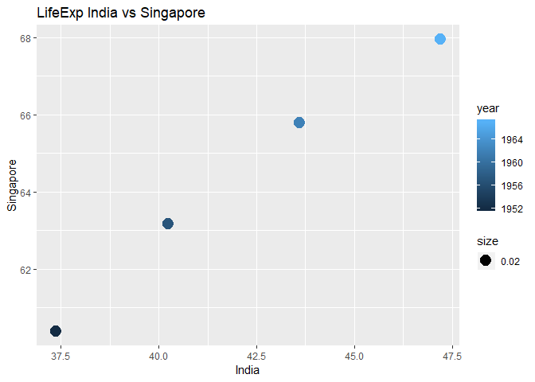

### Load packages

```r
suppressPackageStartupMessages(library(tidyverse))
library(knitr)
library(gapminder)
library(kableExtra)
```

### Data Reshaping
For data reshaping, I am using a portion of gapminder data.
I will do a mix of Activity #1 and #2 on this data

#### Data

```r
data_dr <- gapminder %>% 
            filter(country %in% c("Singapore", 
                                  "Italy",
                                  "Russia",
                                  "India"),
                   year > 1951 & year < 1972) %>%
            select(continent,country,year,lifeExp)
kable(data_dr) %>% 
  kable_styling(c("striped", "bordered"),
                full_width = F)
```

<table class="table table-striped table-bordered" style="width: auto !important; margin-left: auto; margin-right: auto;">
 <thead>
  <tr>
   <th style="text-align:left;"> continent </th>
   <th style="text-align:left;"> country </th>
   <th style="text-align:right;"> year </th>
   <th style="text-align:right;"> lifeExp </th>
  </tr>
 </thead>
<tbody>
  <tr>
   <td style="text-align:left;"> Asia </td>
   <td style="text-align:left;"> India </td>
   <td style="text-align:right;"> 1952 </td>
   <td style="text-align:right;"> 37.373 </td>
  </tr>
  <tr>
   <td style="text-align:left;"> Asia </td>
   <td style="text-align:left;"> India </td>
   <td style="text-align:right;"> 1957 </td>
   <td style="text-align:right;"> 40.249 </td>
  </tr>
  <tr>
   <td style="text-align:left;"> Asia </td>
   <td style="text-align:left;"> India </td>
   <td style="text-align:right;"> 1962 </td>
   <td style="text-align:right;"> 43.605 </td>
  </tr>
  <tr>
   <td style="text-align:left;"> Asia </td>
   <td style="text-align:left;"> India </td>
   <td style="text-align:right;"> 1967 </td>
   <td style="text-align:right;"> 47.193 </td>
  </tr>
  <tr>
   <td style="text-align:left;"> Europe </td>
   <td style="text-align:left;"> Italy </td>
   <td style="text-align:right;"> 1952 </td>
   <td style="text-align:right;"> 65.940 </td>
  </tr>
  <tr>
   <td style="text-align:left;"> Europe </td>
   <td style="text-align:left;"> Italy </td>
   <td style="text-align:right;"> 1957 </td>
   <td style="text-align:right;"> 67.810 </td>
  </tr>
  <tr>
   <td style="text-align:left;"> Europe </td>
   <td style="text-align:left;"> Italy </td>
   <td style="text-align:right;"> 1962 </td>
   <td style="text-align:right;"> 69.240 </td>
  </tr>
  <tr>
   <td style="text-align:left;"> Europe </td>
   <td style="text-align:left;"> Italy </td>
   <td style="text-align:right;"> 1967 </td>
   <td style="text-align:right;"> 71.060 </td>
  </tr>
  <tr>
   <td style="text-align:left;"> Asia </td>
   <td style="text-align:left;"> Singapore </td>
   <td style="text-align:right;"> 1952 </td>
   <td style="text-align:right;"> 60.396 </td>
  </tr>
  <tr>
   <td style="text-align:left;"> Asia </td>
   <td style="text-align:left;"> Singapore </td>
   <td style="text-align:right;"> 1957 </td>
   <td style="text-align:right;"> 63.179 </td>
  </tr>
  <tr>
   <td style="text-align:left;"> Asia </td>
   <td style="text-align:left;"> Singapore </td>
   <td style="text-align:right;"> 1962 </td>
   <td style="text-align:right;"> 65.798 </td>
  </tr>
  <tr>
   <td style="text-align:left;"> Asia </td>
   <td style="text-align:left;"> Singapore </td>
   <td style="text-align:right;"> 1967 </td>
   <td style="text-align:right;"> 67.946 </td>
  </tr>
</tbody>
</table>

Converting the data for each country to show the yearly trend in one row(columns for each year)


```r
sdr <- data_dr %>%
        spread(year, lifeExp)
kable(sdr) %>% 
  kable_styling(c("striped", "bordered"),
                full_width = F)
```

<table class="table table-striped table-bordered" style="width: auto !important; margin-left: auto; margin-right: auto;">
 <thead>
  <tr>
   <th style="text-align:left;"> continent </th>
   <th style="text-align:left;"> country </th>
   <th style="text-align:right;"> 1952 </th>
   <th style="text-align:right;"> 1957 </th>
   <th style="text-align:right;"> 1962 </th>
   <th style="text-align:right;"> 1967 </th>
  </tr>
 </thead>
<tbody>
  <tr>
   <td style="text-align:left;"> Asia </td>
   <td style="text-align:left;"> India </td>
   <td style="text-align:right;"> 37.373 </td>
   <td style="text-align:right;"> 40.249 </td>
   <td style="text-align:right;"> 43.605 </td>
   <td style="text-align:right;"> 47.193 </td>
  </tr>
  <tr>
   <td style="text-align:left;"> Asia </td>
   <td style="text-align:left;"> Singapore </td>
   <td style="text-align:right;"> 60.396 </td>
   <td style="text-align:right;"> 63.179 </td>
   <td style="text-align:right;"> 65.798 </td>
   <td style="text-align:right;"> 67.946 </td>
  </tr>
  <tr>
   <td style="text-align:left;"> Europe </td>
   <td style="text-align:left;"> Italy </td>
   <td style="text-align:right;"> 65.940 </td>
   <td style="text-align:right;"> 67.810 </td>
   <td style="text-align:right;"> 69.240 </td>
   <td style="text-align:right;"> 71.060 </td>
  </tr>
</tbody>
</table>

The above table is easy to analyse and mutate. For example if want to add a column for change in lifeExp from 1952 to 1967:


```r
sdr %>%
  mutate(change = `1967` - `1952`) %>%
  kable() %>% 
  kable_styling(c("striped", "bordered"),
                full_width = F)
```

<table class="table table-striped table-bordered" style="width: auto !important; margin-left: auto; margin-right: auto;">
 <thead>
  <tr>
   <th style="text-align:left;"> continent </th>
   <th style="text-align:left;"> country </th>
   <th style="text-align:right;"> 1952 </th>
   <th style="text-align:right;"> 1957 </th>
   <th style="text-align:right;"> 1962 </th>
   <th style="text-align:right;"> 1967 </th>
   <th style="text-align:right;"> change </th>
  </tr>
 </thead>
<tbody>
  <tr>
   <td style="text-align:left;"> Asia </td>
   <td style="text-align:left;"> India </td>
   <td style="text-align:right;"> 37.373 </td>
   <td style="text-align:right;"> 40.249 </td>
   <td style="text-align:right;"> 43.605 </td>
   <td style="text-align:right;"> 47.193 </td>
   <td style="text-align:right;"> 9.82 </td>
  </tr>
  <tr>
   <td style="text-align:left;"> Asia </td>
   <td style="text-align:left;"> Singapore </td>
   <td style="text-align:right;"> 60.396 </td>
   <td style="text-align:right;"> 63.179 </td>
   <td style="text-align:right;"> 65.798 </td>
   <td style="text-align:right;"> 67.946 </td>
   <td style="text-align:right;"> 7.55 </td>
  </tr>
  <tr>
   <td style="text-align:left;"> Europe </td>
   <td style="text-align:left;"> Italy </td>
   <td style="text-align:right;"> 65.940 </td>
   <td style="text-align:right;"> 67.810 </td>
   <td style="text-align:right;"> 69.240 </td>
   <td style="text-align:right;"> 71.060 </td>
   <td style="text-align:right;"> 5.12 </td>
  </tr>
</tbody>
</table>

To revert the changes:


```r
sdr %>% 
  gather(year,lifeExp,"1952","1957","1962","1967") %>%
  kable() %>% 
  kable_styling(c("striped", "bordered"),
                full_width = F)
```

<table class="table table-striped table-bordered" style="width: auto !important; margin-left: auto; margin-right: auto;">
 <thead>
  <tr>
   <th style="text-align:left;"> continent </th>
   <th style="text-align:left;"> country </th>
   <th style="text-align:left;"> year </th>
   <th style="text-align:right;"> lifeExp </th>
  </tr>
 </thead>
<tbody>
  <tr>
   <td style="text-align:left;"> Asia </td>
   <td style="text-align:left;"> India </td>
   <td style="text-align:left;"> 1952 </td>
   <td style="text-align:right;"> 37.373 </td>
  </tr>
  <tr>
   <td style="text-align:left;"> Asia </td>
   <td style="text-align:left;"> Singapore </td>
   <td style="text-align:left;"> 1952 </td>
   <td style="text-align:right;"> 60.396 </td>
  </tr>
  <tr>
   <td style="text-align:left;"> Europe </td>
   <td style="text-align:left;"> Italy </td>
   <td style="text-align:left;"> 1952 </td>
   <td style="text-align:right;"> 65.940 </td>
  </tr>
  <tr>
   <td style="text-align:left;"> Asia </td>
   <td style="text-align:left;"> India </td>
   <td style="text-align:left;"> 1957 </td>
   <td style="text-align:right;"> 40.249 </td>
  </tr>
  <tr>
   <td style="text-align:left;"> Asia </td>
   <td style="text-align:left;"> Singapore </td>
   <td style="text-align:left;"> 1957 </td>
   <td style="text-align:right;"> 63.179 </td>
  </tr>
  <tr>
   <td style="text-align:left;"> Europe </td>
   <td style="text-align:left;"> Italy </td>
   <td style="text-align:left;"> 1957 </td>
   <td style="text-align:right;"> 67.810 </td>
  </tr>
  <tr>
   <td style="text-align:left;"> Asia </td>
   <td style="text-align:left;"> India </td>
   <td style="text-align:left;"> 1962 </td>
   <td style="text-align:right;"> 43.605 </td>
  </tr>
  <tr>
   <td style="text-align:left;"> Asia </td>
   <td style="text-align:left;"> Singapore </td>
   <td style="text-align:left;"> 1962 </td>
   <td style="text-align:right;"> 65.798 </td>
  </tr>
  <tr>
   <td style="text-align:left;"> Europe </td>
   <td style="text-align:left;"> Italy </td>
   <td style="text-align:left;"> 1962 </td>
   <td style="text-align:right;"> 69.240 </td>
  </tr>
  <tr>
   <td style="text-align:left;"> Asia </td>
   <td style="text-align:left;"> India </td>
   <td style="text-align:left;"> 1967 </td>
   <td style="text-align:right;"> 47.193 </td>
  </tr>
  <tr>
   <td style="text-align:left;"> Asia </td>
   <td style="text-align:left;"> Singapore </td>
   <td style="text-align:left;"> 1967 </td>
   <td style="text-align:right;"> 67.946 </td>
  </tr>
  <tr>
   <td style="text-align:left;"> Europe </td>
   <td style="text-align:left;"> Italy </td>
   <td style="text-align:left;"> 1967 </td>
   <td style="text-align:right;"> 71.060 </td>
  </tr>
</tbody>
</table>

Now lets spread the initial data to have separate columns for each country


```r
data_dr %>% 
  spread(country,lifeExp) %>% 
  kable() %>% 
  kable_styling(c("striped", "bordered"),
                full_width = F)
```

<table class="table table-striped table-bordered" style="width: auto !important; margin-left: auto; margin-right: auto;">
 <thead>
  <tr>
   <th style="text-align:left;"> continent </th>
   <th style="text-align:right;"> year </th>
   <th style="text-align:right;"> India </th>
   <th style="text-align:right;"> Italy </th>
   <th style="text-align:right;"> Singapore </th>
  </tr>
 </thead>
<tbody>
  <tr>
   <td style="text-align:left;"> Asia </td>
   <td style="text-align:right;"> 1952 </td>
   <td style="text-align:right;"> 37.373 </td>
   <td style="text-align:right;"> NA </td>
   <td style="text-align:right;"> 60.396 </td>
  </tr>
  <tr>
   <td style="text-align:left;"> Asia </td>
   <td style="text-align:right;"> 1957 </td>
   <td style="text-align:right;"> 40.249 </td>
   <td style="text-align:right;"> NA </td>
   <td style="text-align:right;"> 63.179 </td>
  </tr>
  <tr>
   <td style="text-align:left;"> Asia </td>
   <td style="text-align:right;"> 1962 </td>
   <td style="text-align:right;"> 43.605 </td>
   <td style="text-align:right;"> NA </td>
   <td style="text-align:right;"> 65.798 </td>
  </tr>
  <tr>
   <td style="text-align:left;"> Asia </td>
   <td style="text-align:right;"> 1967 </td>
   <td style="text-align:right;"> 47.193 </td>
   <td style="text-align:right;"> NA </td>
   <td style="text-align:right;"> 67.946 </td>
  </tr>
  <tr>
   <td style="text-align:left;"> Europe </td>
   <td style="text-align:right;"> 1952 </td>
   <td style="text-align:right;"> NA </td>
   <td style="text-align:right;"> 65.94 </td>
   <td style="text-align:right;"> NA </td>
  </tr>
  <tr>
   <td style="text-align:left;"> Europe </td>
   <td style="text-align:right;"> 1957 </td>
   <td style="text-align:right;"> NA </td>
   <td style="text-align:right;"> 67.81 </td>
   <td style="text-align:right;"> NA </td>
  </tr>
  <tr>
   <td style="text-align:left;"> Europe </td>
   <td style="text-align:right;"> 1962 </td>
   <td style="text-align:right;"> NA </td>
   <td style="text-align:right;"> 69.24 </td>
   <td style="text-align:right;"> NA </td>
  </tr>
  <tr>
   <td style="text-align:left;"> Europe </td>
   <td style="text-align:right;"> 1967 </td>
   <td style="text-align:right;"> NA </td>
   <td style="text-align:right;"> 71.06 </td>
   <td style="text-align:right;"> NA </td>
  </tr>
</tbody>
</table>

Lets make a scatterplot for lifeExp of India vs Singapore

#### Data of two countries:


```r
data_dr %>%
  filter(continent == "Asia") %>%
  spread(country,lifeExp) %>%
  kable() %>% 
  kable_styling(c("striped", "bordered"),
                full_width = F)
```

<table class="table table-striped table-bordered" style="width: auto !important; margin-left: auto; margin-right: auto;">
 <thead>
  <tr>
   <th style="text-align:left;"> continent </th>
   <th style="text-align:right;"> year </th>
   <th style="text-align:right;"> India </th>
   <th style="text-align:right;"> Singapore </th>
  </tr>
 </thead>
<tbody>
  <tr>
   <td style="text-align:left;"> Asia </td>
   <td style="text-align:right;"> 1952 </td>
   <td style="text-align:right;"> 37.373 </td>
   <td style="text-align:right;"> 60.396 </td>
  </tr>
  <tr>
   <td style="text-align:left;"> Asia </td>
   <td style="text-align:right;"> 1957 </td>
   <td style="text-align:right;"> 40.249 </td>
   <td style="text-align:right;"> 63.179 </td>
  </tr>
  <tr>
   <td style="text-align:left;"> Asia </td>
   <td style="text-align:right;"> 1962 </td>
   <td style="text-align:right;"> 43.605 </td>
   <td style="text-align:right;"> 65.798 </td>
  </tr>
  <tr>
   <td style="text-align:left;"> Asia </td>
   <td style="text-align:right;"> 1967 </td>
   <td style="text-align:right;"> 47.193 </td>
   <td style="text-align:right;"> 67.946 </td>
  </tr>
</tbody>
</table>


#### Scatter-plot


```r
data_dr %>%
  filter(continent == "Asia") %>%
  spread(country,lifeExp) %>%
  ggplot(aes(India,Singapore)) +
  geom_point(aes(color = year,
                 cex=.02)) +
  ggtitle("LifeExp India vs Singapore")
```

<!-- -->

So, plot above shows that there is almost linear increase in lifeExp for both the countries.

### Table join
For table join cheatsheet I am doing Activity #2

#### Data
I am taking data of some of the shows(I like) and their ratings on IMDb.


```r
shows <- tibble(name = c("Office","Walking Dead",
                         "Stranger Things","Friends"), 
                genre = c("comedy","Sci-fi",
                          "Sci-fi","comedy"),
                continuing = c("No","Yes","Yes","No"),
                seasons = c(10, 9, 2, 10))
rating <- tibble(name = c("Walking Dead", "Office",
                          "Narcos", "Stranger Things"), 
                 rating = c(8.4, 8.8, 9.1, 9.0))
kable(shows, caption = "Shows") %>% 
  kable_styling(c("striped", "bordered"),
                full_width = F)
```

<table class="table table-striped table-bordered" style="width: auto !important; margin-left: auto; margin-right: auto;">
<caption>Shows</caption>
 <thead>
  <tr>
   <th style="text-align:left;"> name </th>
   <th style="text-align:left;"> genre </th>
   <th style="text-align:left;"> continuing </th>
   <th style="text-align:right;"> seasons </th>
  </tr>
 </thead>
<tbody>
  <tr>
   <td style="text-align:left;"> Office </td>
   <td style="text-align:left;"> comedy </td>
   <td style="text-align:left;"> No </td>
   <td style="text-align:right;"> 10 </td>
  </tr>
  <tr>
   <td style="text-align:left;"> Walking Dead </td>
   <td style="text-align:left;"> Sci-fi </td>
   <td style="text-align:left;"> Yes </td>
   <td style="text-align:right;"> 9 </td>
  </tr>
  <tr>
   <td style="text-align:left;"> Stranger Things </td>
   <td style="text-align:left;"> Sci-fi </td>
   <td style="text-align:left;"> Yes </td>
   <td style="text-align:right;"> 2 </td>
  </tr>
  <tr>
   <td style="text-align:left;"> Friends </td>
   <td style="text-align:left;"> comedy </td>
   <td style="text-align:left;"> No </td>
   <td style="text-align:right;"> 10 </td>
  </tr>
</tbody>
</table>

```r
kable(rating, caption = "Rating") %>% 
  kable_styling(c("striped", "bordered"),
                full_width = F)
```

<table class="table table-striped table-bordered" style="width: auto !important; margin-left: auto; margin-right: auto;">
<caption>Rating</caption>
 <thead>
  <tr>
   <th style="text-align:left;"> name </th>
   <th style="text-align:right;"> rating </th>
  </tr>
 </thead>
<tbody>
  <tr>
   <td style="text-align:left;"> Walking Dead </td>
   <td style="text-align:right;"> 8.4 </td>
  </tr>
  <tr>
   <td style="text-align:left;"> Office </td>
   <td style="text-align:right;"> 8.8 </td>
  </tr>
  <tr>
   <td style="text-align:left;"> Narcos </td>
   <td style="text-align:right;"> 9.1 </td>
  </tr>
  <tr>
   <td style="text-align:left;"> Stranger Things </td>
   <td style="text-align:right;"> 9.0 </td>
  </tr>
</tbody>
</table>

Lets try some of the table joining functions on tables above.

If I want to combine the data from above two tables for my analysis, I can use inner_join(). But if I want to discard the observations from one table which are not there in my second table without mutating the columns, I can use semi_join()


```r
ijsr <- inner_join(shows, rating)
```

```
## Joining, by = "name"
```

```r
sjsr <- semi_join(shows,rating)
```

```
## Joining, by = "name"
```

```r
kable(ijsr, caption = "Inner_join()") %>% 
  kable_styling(c("striped", "bordered"),
                full_width = F)
```

<table class="table table-striped table-bordered" style="width: auto !important; margin-left: auto; margin-right: auto;">
<caption>Inner_join()</caption>
 <thead>
  <tr>
   <th style="text-align:left;"> name </th>
   <th style="text-align:left;"> genre </th>
   <th style="text-align:left;"> continuing </th>
   <th style="text-align:right;"> seasons </th>
   <th style="text-align:right;"> rating </th>
  </tr>
 </thead>
<tbody>
  <tr>
   <td style="text-align:left;"> Office </td>
   <td style="text-align:left;"> comedy </td>
   <td style="text-align:left;"> No </td>
   <td style="text-align:right;"> 10 </td>
   <td style="text-align:right;"> 8.8 </td>
  </tr>
  <tr>
   <td style="text-align:left;"> Walking Dead </td>
   <td style="text-align:left;"> Sci-fi </td>
   <td style="text-align:left;"> Yes </td>
   <td style="text-align:right;"> 9 </td>
   <td style="text-align:right;"> 8.4 </td>
  </tr>
  <tr>
   <td style="text-align:left;"> Stranger Things </td>
   <td style="text-align:left;"> Sci-fi </td>
   <td style="text-align:left;"> Yes </td>
   <td style="text-align:right;"> 2 </td>
   <td style="text-align:right;"> 9.0 </td>
  </tr>
</tbody>
</table>

```r
kable(sjsr, caption = "Semi_join()") %>% 
  kable_styling(c("striped", "bordered"),
                full_width = F)
```

<table class="table table-striped table-bordered" style="width: auto !important; margin-left: auto; margin-right: auto;">
<caption>Semi_join()</caption>
 <thead>
  <tr>
   <th style="text-align:left;"> name </th>
   <th style="text-align:left;"> genre </th>
   <th style="text-align:left;"> continuing </th>
   <th style="text-align:right;"> seasons </th>
  </tr>
 </thead>
<tbody>
  <tr>
   <td style="text-align:left;"> Office </td>
   <td style="text-align:left;"> comedy </td>
   <td style="text-align:left;"> No </td>
   <td style="text-align:right;"> 10 </td>
  </tr>
  <tr>
   <td style="text-align:left;"> Walking Dead </td>
   <td style="text-align:left;"> Sci-fi </td>
   <td style="text-align:left;"> Yes </td>
   <td style="text-align:right;"> 9 </td>
  </tr>
  <tr>
   <td style="text-align:left;"> Stranger Things </td>
   <td style="text-align:left;"> Sci-fi </td>
   <td style="text-align:left;"> Yes </td>
   <td style="text-align:right;"> 2 </td>
  </tr>
</tbody>
</table>

As I did not mention the variable label to be used to join the tables, it does that by the common label found in two tibbles(name). 
Also, as we can see semi_join(x,y) retains the data for x="shows". So, we can define x and y as per our requirement.

In above both the functions data was lost. If we do not want to lose the data from our primary table, we can do so by using either left_join() or right_join()


```r
ljsr <- left_join(shows, rating)
```

```
## Joining, by = "name"
```

```r
rjsr <- right_join(shows,rating)
```

```
## Joining, by = "name"
```

```r
kable(ljsr, caption = "Left_join()") %>% 
  kable_styling(c("striped", "bordered"),
                full_width = F)
```

<table class="table table-striped table-bordered" style="width: auto !important; margin-left: auto; margin-right: auto;">
<caption>Left_join()</caption>
 <thead>
  <tr>
   <th style="text-align:left;"> name </th>
   <th style="text-align:left;"> genre </th>
   <th style="text-align:left;"> continuing </th>
   <th style="text-align:right;"> seasons </th>
   <th style="text-align:right;"> rating </th>
  </tr>
 </thead>
<tbody>
  <tr>
   <td style="text-align:left;"> Office </td>
   <td style="text-align:left;"> comedy </td>
   <td style="text-align:left;"> No </td>
   <td style="text-align:right;"> 10 </td>
   <td style="text-align:right;"> 8.8 </td>
  </tr>
  <tr>
   <td style="text-align:left;"> Walking Dead </td>
   <td style="text-align:left;"> Sci-fi </td>
   <td style="text-align:left;"> Yes </td>
   <td style="text-align:right;"> 9 </td>
   <td style="text-align:right;"> 8.4 </td>
  </tr>
  <tr>
   <td style="text-align:left;"> Stranger Things </td>
   <td style="text-align:left;"> Sci-fi </td>
   <td style="text-align:left;"> Yes </td>
   <td style="text-align:right;"> 2 </td>
   <td style="text-align:right;"> 9.0 </td>
  </tr>
  <tr>
   <td style="text-align:left;"> Friends </td>
   <td style="text-align:left;"> comedy </td>
   <td style="text-align:left;"> No </td>
   <td style="text-align:right;"> 10 </td>
   <td style="text-align:right;"> NA </td>
  </tr>
</tbody>
</table>

```r
kable(shows, caption = "Right_join()") %>% 
  kable_styling(c("striped", "bordered"),
                full_width = F)
```

<table class="table table-striped table-bordered" style="width: auto !important; margin-left: auto; margin-right: auto;">
<caption>Right_join()</caption>
 <thead>
  <tr>
   <th style="text-align:left;"> name </th>
   <th style="text-align:left;"> genre </th>
   <th style="text-align:left;"> continuing </th>
   <th style="text-align:right;"> seasons </th>
  </tr>
 </thead>
<tbody>
  <tr>
   <td style="text-align:left;"> Office </td>
   <td style="text-align:left;"> comedy </td>
   <td style="text-align:left;"> No </td>
   <td style="text-align:right;"> 10 </td>
  </tr>
  <tr>
   <td style="text-align:left;"> Walking Dead </td>
   <td style="text-align:left;"> Sci-fi </td>
   <td style="text-align:left;"> Yes </td>
   <td style="text-align:right;"> 9 </td>
  </tr>
  <tr>
   <td style="text-align:left;"> Stranger Things </td>
   <td style="text-align:left;"> Sci-fi </td>
   <td style="text-align:left;"> Yes </td>
   <td style="text-align:right;"> 2 </td>
  </tr>
  <tr>
   <td style="text-align:left;"> Friends </td>
   <td style="text-align:left;"> comedy </td>
   <td style="text-align:left;"> No </td>
   <td style="text-align:right;"> 10 </td>
  </tr>
</tbody>
</table>


As you can see, left_join(x,y) retains all rows of x and right_join(x,y) retains all rows of y.

If we have a huge database and want to see which observations from primary table are missing in secondary table, we can use anti_join().


```r
ajsr1 <- anti_join(shows, rating)
```

```
## Joining, by = "name"
```

```r
ajsr2 <- anti_join(rating,shows)
```

```
## Joining, by = "name"
```

```r
kable(ajsr1, caption = "Anti_join(Shows,Rating)") %>% 
  kable_styling(c("striped", "bordered"),
                full_width = F)
```

<table class="table table-striped table-bordered" style="width: auto !important; margin-left: auto; margin-right: auto;">
<caption>Anti_join(Shows,Rating)</caption>
 <thead>
  <tr>
   <th style="text-align:left;"> name </th>
   <th style="text-align:left;"> genre </th>
   <th style="text-align:left;"> continuing </th>
   <th style="text-align:right;"> seasons </th>
  </tr>
 </thead>
<tbody>
  <tr>
   <td style="text-align:left;"> Friends </td>
   <td style="text-align:left;"> comedy </td>
   <td style="text-align:left;"> No </td>
   <td style="text-align:right;"> 10 </td>
  </tr>
</tbody>
</table>

```r
kable(ajsr2, caption = "Anti_join(Rating,Shows)") %>% 
  kable_styling(c("striped", "bordered"),
                full_width = F)
```

<table class="table table-striped table-bordered" style="width: auto !important; margin-left: auto; margin-right: auto;">
<caption>Anti_join(Rating,Shows)</caption>
 <thead>
  <tr>
   <th style="text-align:left;"> name </th>
   <th style="text-align:right;"> rating </th>
  </tr>
 </thead>
<tbody>
  <tr>
   <td style="text-align:left;"> Narcos </td>
   <td style="text-align:right;"> 9.1 </td>
  </tr>
</tbody>
</table>

If we decide that we cannot afford to loose any data, full_join() can be used.


```r
fjsr <- full_join(shows, rating)
```

```
## Joining, by = "name"
```

```r
kable(fjsr, caption = "Full_join()") %>% 
  kable_styling(c("striped", "bordered"),
                full_width = F)
```

<table class="table table-striped table-bordered" style="width: auto !important; margin-left: auto; margin-right: auto;">
<caption>Full_join()</caption>
 <thead>
  <tr>
   <th style="text-align:left;"> name </th>
   <th style="text-align:left;"> genre </th>
   <th style="text-align:left;"> continuing </th>
   <th style="text-align:right;"> seasons </th>
   <th style="text-align:right;"> rating </th>
  </tr>
 </thead>
<tbody>
  <tr>
   <td style="text-align:left;"> Office </td>
   <td style="text-align:left;"> comedy </td>
   <td style="text-align:left;"> No </td>
   <td style="text-align:right;"> 10 </td>
   <td style="text-align:right;"> 8.8 </td>
  </tr>
  <tr>
   <td style="text-align:left;"> Walking Dead </td>
   <td style="text-align:left;"> Sci-fi </td>
   <td style="text-align:left;"> Yes </td>
   <td style="text-align:right;"> 9 </td>
   <td style="text-align:right;"> 8.4 </td>
  </tr>
  <tr>
   <td style="text-align:left;"> Stranger Things </td>
   <td style="text-align:left;"> Sci-fi </td>
   <td style="text-align:left;"> Yes </td>
   <td style="text-align:right;"> 2 </td>
   <td style="text-align:right;"> 9.0 </td>
  </tr>
  <tr>
   <td style="text-align:left;"> Friends </td>
   <td style="text-align:left;"> comedy </td>
   <td style="text-align:left;"> No </td>
   <td style="text-align:right;"> 10 </td>
   <td style="text-align:right;"> NA </td>
  </tr>
  <tr>
   <td style="text-align:left;"> Narcos </td>
   <td style="text-align:left;"> NA </td>
   <td style="text-align:left;"> NA </td>
   <td style="text-align:right;"> NA </td>
   <td style="text-align:right;"> 9.1 </td>
  </tr>
</tbody>
</table>

Lets see what merge() does to the data above.


```r
msr <- merge(shows, rating)
kable(ijsr, caption = "Inner_join()") %>% 
  kable_styling(c("striped", "bordered"),
                full_width = F)
```

<table class="table table-striped table-bordered" style="width: auto !important; margin-left: auto; margin-right: auto;">
<caption>Inner_join()</caption>
 <thead>
  <tr>
   <th style="text-align:left;"> name </th>
   <th style="text-align:left;"> genre </th>
   <th style="text-align:left;"> continuing </th>
   <th style="text-align:right;"> seasons </th>
   <th style="text-align:right;"> rating </th>
  </tr>
 </thead>
<tbody>
  <tr>
   <td style="text-align:left;"> Office </td>
   <td style="text-align:left;"> comedy </td>
   <td style="text-align:left;"> No </td>
   <td style="text-align:right;"> 10 </td>
   <td style="text-align:right;"> 8.8 </td>
  </tr>
  <tr>
   <td style="text-align:left;"> Walking Dead </td>
   <td style="text-align:left;"> Sci-fi </td>
   <td style="text-align:left;"> Yes </td>
   <td style="text-align:right;"> 9 </td>
   <td style="text-align:right;"> 8.4 </td>
  </tr>
  <tr>
   <td style="text-align:left;"> Stranger Things </td>
   <td style="text-align:left;"> Sci-fi </td>
   <td style="text-align:left;"> Yes </td>
   <td style="text-align:right;"> 2 </td>
   <td style="text-align:right;"> 9.0 </td>
  </tr>
</tbody>
</table>

```r
kable(msr, caption = "Merge()") %>% 
  kable_styling(c("striped", "bordered"),
                full_width = F)
```

<table class="table table-striped table-bordered" style="width: auto !important; margin-left: auto; margin-right: auto;">
<caption>Merge()</caption>
 <thead>
  <tr>
   <th style="text-align:left;"> name </th>
   <th style="text-align:left;"> genre </th>
   <th style="text-align:left;"> continuing </th>
   <th style="text-align:right;"> seasons </th>
   <th style="text-align:right;"> rating </th>
  </tr>
 </thead>
<tbody>
  <tr>
   <td style="text-align:left;"> Office </td>
   <td style="text-align:left;"> comedy </td>
   <td style="text-align:left;"> No </td>
   <td style="text-align:right;"> 10 </td>
   <td style="text-align:right;"> 8.8 </td>
  </tr>
  <tr>
   <td style="text-align:left;"> Stranger Things </td>
   <td style="text-align:left;"> Sci-fi </td>
   <td style="text-align:left;"> Yes </td>
   <td style="text-align:right;"> 2 </td>
   <td style="text-align:right;"> 9.0 </td>
  </tr>
  <tr>
   <td style="text-align:left;"> Walking Dead </td>
   <td style="text-align:left;"> Sci-fi </td>
   <td style="text-align:left;"> Yes </td>
   <td style="text-align:right;"> 9 </td>
   <td style="text-align:right;"> 8.4 </td>
  </tr>
</tbody>
</table>

So, the output of merge() is same as dplyr function inner_join(). However, in inner_join(x,y), the order of output is same as x="shows" but that is not the case in merge().
